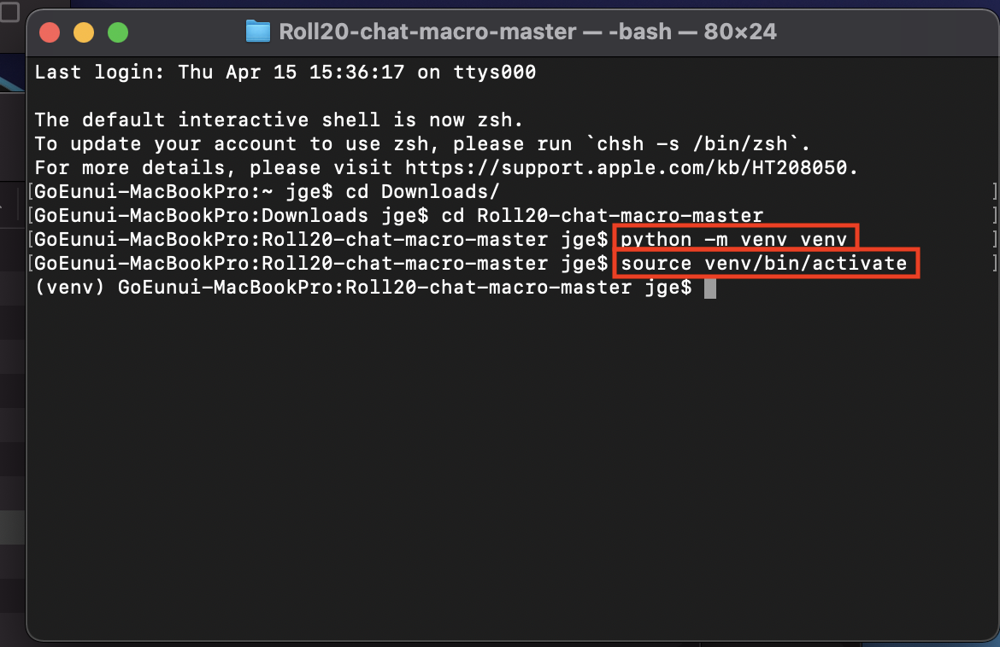
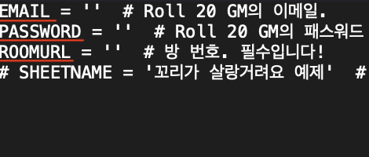
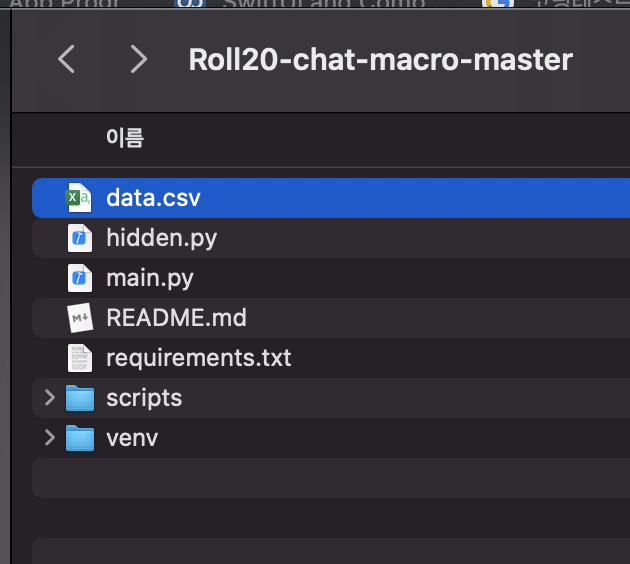

# Roll 20 채팅 매크로 사용법

### 서문

키퍼는 매번 복붙을 하며 수제로 채팅을 해야 합니다.

...

귀찮습니다!

그래서 자동으로 입력해주는 매크로를 만들어 보았습니다.


### 본문

준비물 : 키퍼분의 이메일 및 비밀번호, 엑셀 파일, 자신감

준비 환경 : 파이썬3, cmd 또는 터미널

준비 지식 : 밑의 $은 cmd(터미널)에 입력하라는 뜻입니다. 만약 밑과 같은 문구이면 cmd(터미널)에 $ 을 제외한 cd 만 입력해주세요.

또 가상환경일 시 (venv)를 맨 앞에 표기합니다.

```
$ cd
```


☑ 20.04.15 : macOS 및 Window10 테스트 완료


# 1. 시나리오 엑셀 파일 만들기.

휘핑 명령어 편집기(http://trpg.whippy.kr/desc) 에 들어갑니다.


저는 테스트 시나리오를 입력하였습니다. 이렇게 입력한 후 **<조각내기>** 버튼을 클릭합니다.


그러면 이렇게 줄 단위로 조각을 낼 수 있습니다. **저장하기** 버튼을 눌러 엑셀 파일로 저장합니다. 


이런이런 식으로 .csv 파일이 만들어 집니다. 그릭고 이 엑셀파일의 1~8 행을 삭제해주시고 1행부터 입력할 것이 들어있게 수정한 후 저장해주세요. 안그러면 오류가...


엑셀 파일 준비가 끝났습니다! 🎉🎉


# 2. 파이썬 세팅하기

컴퓨터에 파이썬3을 다운받아 주세요. (윈도우의 경우 PATH 설정도 필수입니다.)

윈도우 파이썬 3.7 -> https://url.kr/gc16xq

그 후, 위 레포지토리를 다운받습니다.

**초록색 Code** 버튼을 클릭합니다. 그 후 **Download ZIP**을 선택하여 .zip을 다운받은 후 압축을 풉니다.


그렇다면 다운로드 폴더 안에 Roll20-chat-macro 폴더가 생길 것입니다.


폴더를 보면 이러한 파일이 있을 것입니다. 

사용할 것 : main.py, requirements.txt

추가해야 할 것 : 엑셀 파일, hidden.py에 GM의 이메일 및 비밀번호


### VENV 설정.

venv란 가상환경으로, 파이썬의 패키지를 관리합니다. 위 매크로에는 pick, 스프레드 시트를 위한 패키지가 있으므로 venv를 설정하여 패키지를 다운받아야 합니다.

#### 1. cmd(터미널) 키기. 


#### 2. 다운로드 폴더로 이동하기

```
$ cd Downloads/
```


#### 3. 다운로드 폴더에서 Roll20-chat-macro 폴더로 이동합니다.

```
$ cd Roll20-chat-macro
```


드디어 이 프로젝트의 폴더까지 오는 여정이 끝났습니다. 🎉

#### 4. venv 생성

저 터미널 환경에서 아래 명령어를 입력합니다.

```
$ python -m venv venv
```

결과 : venv 폴더가 생성됨.


#### 5. venv 활성화

venv를 만들었지만, 아직 활성화되지 않았습니다. activate를 통해 활성화시켜 줍시다.

- Window

```
$ venv\Scripts\activate.bat
```


- macOS

```
$ source venv/bin/activate
```



본인의 컴퓨터 이름 앞에 (venv)가 붙는다면 성공입니다. 이제 가상환경 안에 패키지만 설치하면 됩니다.


#### 6. 파이썬 패키지 설치

```
(venv) $ pip install -r requirements.txt
```

pip라는 툴로 requirements.txt에 있는 모든 패키지를 설치해달라는 뜻입니다.

오류메세지 혹은 계속 멈춰있는 것이 아니라면 설치가 완료된 것입니다.


# 3. GM 계정 및 엑셀파일 추가하기

#### 1. GM 계정 추가

Roll20-chat-macro 폴더에 있는 **hidden.py**를 메모장 등 수정이 가능한 프로그램으로 엽니다.



열면 이렇게 이메일과 패스워드, 룸의 URL이 비어있습니다.

EMAIL = '작은 따옴표 안에 GM의 이메일을 적어주셔야 합니다.' ex) EMAIL = 'test@test.com'

PASSWORD = 'GM의 패스워드를 적어주세요.' ex) PASSWORD = 'password'


ROOMURL은 방 번호를 넣으셔야 합니다. 방 번호를 구하는 법은


https://roll20.net/welcome 에 접속하셔서 본인이 게임을 할 **방의 이름**을 클릭합니다. (게임시작 버튼XXXX)


그렇다면 이렇게 방의 상세를 볼 수 있습니다. 이 화면에서 우리가 주목해야 할 곳은 오직 **URL** 입니다.


https://app.roll20.net/campaigns/details/10367616/teseuteu 라는 긴 URL이 있지만 우리가 신경써야 할 것은 details/ **뒤의 숫자**입니다.

**10367616** 말이에요.

이 부분이 방의 고유숫자입니다. 이 숫자를 ROOMURL에 넣어줍니다. (조금 어렵나요? 🥲)


#### 2. 엑셀파일 추가하기

1번에서 만든 시나리오 엑셀 파일을 **Roll20-chat-macro** 폴더에 **data.csv**로 이름을 바꾸어 넣어주셔야 합니다.



축하합니다!! 드디어 길고 긴 세팅이 끝났습니다! 이제 남은 것은 실행 뿐입니다.

# 4. 매크로 실행

하지만 아직 cmd(터미널)을 닫으시면 안됩니다. Roll20-chat-macro 폴더에서 cmd(터미널)을 통해 매크로를 실행해야 하기 때문입니다.

```
(venv) $ python main.py
```

를 입력하면 매크로가 실행됩니다.

```
Traceback (most recent call last):
  File "main.py", line 1, in <module>
    from pick import pick
ModuleNotFoundError: No module named 'pick'
```

이런 오류가 떴을 경우(제 경우)

```
(venv) $ pip3 install -r requirements.txt
(venv) $ python3 main.py
```

이렇게 실행하니 되었습니다..

아무튼 main.py를 실행하면 


왠 신기한 크롬이 실행되며 roll20 사이트를 자동으로 들어가 로그인합니다. (로그인이 안될 시 hidden.py 파일에 이메일과 비밀번호를 잘 입력했는지 확인해보아요.)


로그인이 성공한다면 이렇게 게임 목록이 뜬 후, 설정한 게임의 방으로 들어갑니다.


GM계정으로 잘 들어오셨다면, 거의 끝나셨습니다. 이제 다시 cmd(터미널)을 확인합니다.

📌 윈도우 지원을 위해 CLI UI가 바뀌었습니다. 아래 스크린샷의 UI와 다르니 양해바랍니다.


엑셀의 맨 처음(A1)에 있는 텍스트가 터미널에서 보입니다!! 


실행결과입니다.

엑셀의 텍스트 또는 패스를 고를 수 있습니다. KP노트나 성공/실패 여부에 따라 다른 대사를 출력할 때 패스를 누르시면 됩니다! (키보드에서 위, 아래 버튼을 누르면 선택 가능합니다.)


수고하셨습니다 !! 

